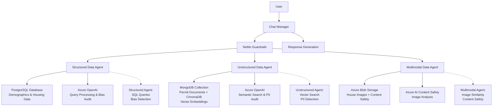

# Building a Multi-Agent AI Assistant with Azure and NeMo Guardrails

This project demonstrates a data management framework for Generative AI, focusing on how multi-agent systems can derive neighborhood insights without compromising data integrity or location.

- Federated Data Strategy: Rather than centralizing information, this architecture manages data at the source. It proves that GenAI can be high-performing without the security risks of mass data movement.
- Data Sovereignty & Control: The system is built on the principle that data owners must never lose custody. By keeping data at its origin, the management layer ensures absolute control and ethical handling.
- Compliance-Driven Architecture: Designed specifically to address the "data friction" in AI—ensuring every interaction complies with evolving global privacy laws and AI governance standards.
- Decentralized Integration: Showcases how to orchestrate multiple, disparate data streams into a unified AI output while maintaining strict boundaries between data providers.

---

## Overview

### What You'll Learn

In this lesson, you'll learn to build an AI-powered assistant that safely queries diverse data types through specialized agents. You'll integrate Azure cloud services for secure authentication, language models, and data storage, while implementing content safety measures.

Learning objectives:

- Implement multi-agent architecture for handling different data modalities
- Integrate Azure services for secure AI applications
- Apply safety guardrails to prevent harmful outputs
- Build a conversational interface for natural language queries

### Prerequisites

- Python 3.8+
- Azure subscription with Key Vault, OpenAI, PostgreSQL, Mongo DB, Blob Storage, and Content Safety
- Nvidia NeMo Gurdrailes and dependency libraries installed
- Basic knowledge of Python, Azure services, and AI concepts

---

## Understanding the Concept

### The Problem

Neighborhood planning and real estate decisions require querying multiple data sources: demographic statistics, permit documents, and property images. Traditional systems struggle with integrating these diverse data types while ensuring user safety and data privacy. Data is diverse, from structured demographics data with potential for bias, unsctructured documents like constructions permits that may contain PII data, and multimodal pictures of houses and infrastructure that could contain harmfull images.

### The Solution

A multi-agent architecture where specialized agents handle different data modalities, coordinated by a central chat manager with safety guardrails. Each data agent specializes in not only sourcing the right data to answer specific user questions and prompts, but to allow complete check on the data and drive ethical use of the same. This approach allows natural language queries across all data sources while maintaining security and compliance.

### How It Works

The system uses three specialized agents:

**Step 1: Structured Data Agent**
Handles demographic and housing data stored in PostgreSQL, performing SQL queries and bias audits.

**Step 2: Unstructured Data Agent**
Processes permit documents in MongoDB using vector embeddings for semantic search, with PII detection.

**Step 3: Multimodal Data Agent**
Finds similar properties using image similarity in Azure Blob Storage, with content safety checks.

All agents are coordinated through NeMo Guardrails, which enforces safety rules and routes queries appropriately.

### Key Terms

**Agent**: A specialized component that handles a specific type of data or task.

**Guardrails**: Safety mechanisms that prevent harmful or inappropriate AI outputs.

**Vector Embeddings**: Numerical representations of text/documents for semantic similarity search.

**PII (Personally Identifiable Information)**: Sensitive data that requires protection.

---

## Architecture Illustration

The multi-agent system architecture is designed to handle diverse data modalities while maintaining data federation and security. The orchestration is managed through NeMo Guardrails, which routes natural language queries to specialized agents based on content analysis.

### Agent Responsibilities

- **Structured Data Agent**: Handles tabular data queries in PostgreSQL, performs bias audits using Fairlearn, and generates SQL-based responses.
- **Unstructured Data Agent**: Processes document collections in MongoDB with vector embeddings via ChromaDB, conducts semantic search, and applies PII detection using Presidio.
- **Multimodal Data Agent**: Analyzes images in Azure Blob Storage for similarity matching, integrates Azure AI Content Safety for harmful content detection.

### Orchestration Flow

1. User submits a natural language query to the Chat Manager.
2. NeMo Guardrails analyzes the query for safety and routes it to the appropriate agent action.
3. The selected agent processes the query against its data source, applying domain-specific safety checks.
4. Results are returned through the guardrails for final response generation.



---

## Project Structure

```
starter/
├── chat.py                         # Chat orchestrator (fill in TODOs)
├── agents/
│   ├── structured_data_agent.py    # PostgreSQL queries + bias auditing
│   ├── unstructured_data_agent.py  # MongoDB RAG + PII detection
│   └── multimodal_data_agent.py    # Image similarity + content safety
└── data/
    ├── structured/                 # Demographics CSV data
    ├── unstructured/               # Permit documents (PDF)
    └── multimodal/                 # House images
```

---

## Important Details

### Common Misconceptions

**Misconception**: "All data needs to be loaded into the AI system for processing"
**Reality**: The solution keeps data in original systems and only processes queries, maintaining data sovereignty.

**Misconception**: "One large language model can handle all data types equally well"
**Reality**: Specialized agents with domain-specific processing provide better accuracy and efficiency.

### Best Practices

1. **Secure Secret Management**: Use Azure Key Vault for all credentials instead of environment variables or config files.
2. **Modular Agent Design**: Separate concerns by data type allows for easier maintenance and scaling.
3. **Safety-First Approach**: Implement guardrails and audits before deploying AI systems.

### Common Errors

**Error**: Authentication failures with Azure services

- **Cause**: Incorrect Key Vault URI or missing Azure CLI login
- **Solution**: Verify `az login` status and Key Vault access policies

**Error**: Import errors for Azure packages

- **Cause**: Missing dependencies or incompatible Python version
- **Solution**: Install from `requirements.txt` and ensure Python 3.8+

## Additional Setup

After installing requirements, run: `python -m spacy download en_core_web_lg`

<style>#mermaid-1776195782763{font-family:sans-serif;font-size:16px;fill:#333;}#mermaid-1776195782763 .error-icon{fill:#552222;}#mermaid-1776195782763 .error-text{fill:#552222;stroke:#552222;}#mermaid-1776195782763 .edge-thickness-normal{stroke-width:2px;}#mermaid-1776195782763 .edge-thickness-thick{stroke-width:3.5px;}#mermaid-1776195782763 .edge-pattern-solid{stroke-dasharray:0;}#mermaid-1776195782763 .edge-pattern-dashed{stroke-dasharray:3;}#mermaid-1776195782763 .edge-pattern-dotted{stroke-dasharray:2;}#mermaid-1776195782763 .marker{fill:#333333;}#mermaid-1776195782763 .marker.cross{stroke:#333333;}#mermaid-1776195782763 svg{font-family:sans-serif;font-size:16px;}#mermaid-1776195782763 .label{font-family:sans-serif;color:#333;}#mermaid-1776195782763 .label text{fill:#333;}#mermaid-1776195782763 .node rect,#mermaid-1776195782763 .node circle,#mermaid-1776195782763 .node ellipse,#mermaid-1776195782763 .node polygon,#mermaid-1776195782763 .node path{fill:#ECECFF;stroke:#9370DB;stroke-width:1px;}#mermaid-1776195782763 .node .label{text-align:center;}#mermaid-1776195782763 .node.clickable{cursor:pointer;}#mermaid-1776195782763 .arrowheadPath{fill:#333333;}#mermaid-1776195782763 .edgePath .path{stroke:#333333;stroke-width:1.5px;}#mermaid-1776195782763 .flowchart-link{stroke:#333333;fill:none;}#mermaid-1776195782763 .edgeLabel{background-color:#e8e8e8;text-align:center;}#mermaid-1776195782763 .edgeLabel rect{opacity:0.5;background-color:#e8e8e8;fill:#e8e8e8;}#mermaid-1776195782763 .cluster rect{fill:#ffffde;stroke:#aaaa33;stroke-width:1px;}#mermaid-1776195782763 .cluster text{fill:#333;}#mermaid-1776195782763 div.mermaidTooltip{position:absolute;text-align:center;max-width:200px;padding:2px;font-family:sans-serif;font-size:12px;background:hsl(80,100%,96.2745098039%);border:1px solid #aaaa33;border-radius:2px;pointer-events:none;z-index:100;}#mermaid-1776195782763:root{--mermaid-font-family:sans-serif;}#mermaid-1776195782763:root{--mermaid-alt-font-family:sans-serif;}#mermaid-1776195782763 flowchart{fill:apa;}</style>
