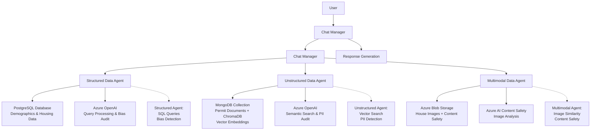

# Building a Multi-Agent AI Assistant with Azure and chat manager

This project demonstrates a data management framework for Generative AI, focusing on how multi-agent systems can derive neighborhood insights without compromising data integrity or location.

 - Federated Data Strategy: Rather than centralizing information, this architecture manages data at the source. It proves that GenAI can be high-performing without the security risks of mass data movement.

 - Data Sovereignty & Control: The system is built on the principle that data owners must never lose custody. By keeping data at its origin, the management layer ensures absolute control and ethical handling.

 - Compliance-Driven Architecture: Designed specifically to address the "data friction" in AI—ensuring every interaction complies with evolving global privacy laws and AI governance standards.

 - Decentralized Integration: Showcases how to orchestrate multiple, disparate data streams into a unified AI output while maintaining strict boundaries between data providers.

---

## Overview

### What You'll Learn

In this lesson, you'll learn to build an AI-powered assistant that safely queries diverse data types through specialized agents. You'll integrate Azure cloud services for secure authentication, language models, and data storage, while implementing content safety measures.

Learning objectives:
- Implement multi-agent architecture for handling different data modalities
- Integrate Azure services for secure AI applications
- Apply safety guardrails to prevent harmful outputs
- Build a conversational interface for natural language queries

### Prerequisites

- Python 3.8+
- Azure subscription with Key Vault, OpenAI, PostgreSQL, Mongo DB, Blob Storage, and Content Safety
- Basic knowledge of Python, Azure services, and AI concepts

---

## Understanding the Concept

### The Problem

Neighborhood planning and real estate decisions require querying multiple data sources: demographic statistics, permit documents, and property images. Traditional systems struggle with integrating these diverse data types while ensuring user safety and data privacy. Data is diverse, from structured demographics data with potential for bias, unsctructured documents like constructions permits that may contain PII data, and multimodal pictures of houses and infrastructure that could contain harmfull images. 

### The Solution

A multi-agent architecture where specialized agents handle different data modalities, coordinated by a central chat manager with safety guardrails. Each data agent specializes in not only sourcing the right data to answer specific user questions and prompts, but to allow complete check on the data and drive ethical use of the same. This approach allows natural language queries across all data sources while maintaining security and compliance.

### How It Works

The system uses three specialized agents:

**Step 1: Structured Data Agent**
Handles demographic and housing data stored in PostgreSQL, performing SQL queries and bias audits.

**Step 2: Unstructured Data Agent**
Processes permit documents in MongoDB using vector embeddings for semantic search, with PII detection.

**Step 3: Multimodal Data Agent**
Finds similar properties using image similarity in Azure Blob Storage, with content safety checks.

All agents are coordinated through a chat manager, which enforces safety rules and routes queries appropriately.

### Key Terms

**Agent**: A specialized component that handles a specific type of data or task.

**Guardrails**: Safety mechanisms that prevent harmful or inappropriate AI outputs.

**Vector Embeddings**: Numerical representations of text/documents for semantic similarity search.

**PII (Personally Identifiable Information)**: Sensitive data that requires protection.

---

## Architecture Illustration

The multi-agent system architecture is designed to handle diverse data modalities while maintaining data federation and security. The orchestration is managed through a chat manager, which routes natural language queries to specialized agents based on content analysis.

### Agent Responsibilities

- **Structured Data Agent**: Handles tabular data queries in PostgreSQL, performs bias audits using Fairlearn, and generates SQL-based responses.
- **Unstructured Data Agent**: Processes document collections in MongoDB with vector embeddings via ChromaDB, conducts semantic search, and applies PII detection using Presidio.
- **Multimodal Data Agent**: Analyzes images in Azure Blob Storage for similarity matching, integrates Azure AI Content Safety for harmful content detection.

### Orchestration Flow

1. User submits a natural language query to the Chat Manager.
2. The selected agent processes the query against its data source, applying domain-specific safety checks.
3. Results are returned through the guardrails for final response generation.



---

## Code Walkthrough

### Repository Structure

```
Project/
├── chat.py                    # Main chat application with agent manager
├── agents/
│   ├── structured_data_agent.py    # PostgreSQL demographic queries
│   ├── unstructured_data_agent.py  # MongoDB document search
│   └── multimodal_data_agent.py    # Image similarity matching
|___data/
    ├── structured/           # Demographics CSV data
    ├── unstructured/         # Permiting documents
    └── multimodal/           # Images of neighborhood homes
```

### Step 1: Setting Up Azure Authentication and Secrets

The application securely retrieves credentials from Azure Key Vault to avoid hardcoding sensitive information. This also allows the implementation of access control to different users based on which kind of data they are allowed to access.

```python
from azure.keyvault.secrets import SecretClient
from azure.identity import InteractiveBrowserCredential

# Connect to Azure Key Vault for secure secret retrieval
KVUri = "https://aiusersecrets.vault.azure.net/"
credential = InteractiveBrowserCredential()
client = SecretClient(vault_url=KVUri, credential=credential)

# ... additional secrets for each agent
```

**Key points:**
- Uses Azure's managed identity for authentication
- Secrets are retrieved at runtime, not stored in code
- Supports multiple Azure services with different credentials

### Step 2: Initializing the Chat Manager and Agents

The AgentChatManager coordinates all components and loads specialized agents for different data types.

```python
class AgentChatManager:
    def __init__(self):
        self.<TODO 9: load _load_agents()>

    # -------------------------
    #  Agents
    # -------------------------
    def <TODO 10: define the _load_agents method to initialize each of the agents with the appropriate secrets and parameters>

        print("\nLoading Structured Data Agent")
        print("-------------------------------")
        self.structured = <TODO 11: initialize the structured data agent with the appropriate parameters, including the database connection parameters and Azure LLM parameters>
            azure_endpoint=structuredazureendpoint,
            api_key=structuredazureapikey,
            deployment="gpt-4.1-mini",
            db_config={
                "host": structuredpostgresqlhost,
                "dbname": structuredpostgresqldbname,
                "user": structuredpostgresqluser,
                "password": structuredpostgresqlpassword,
                "port": 5432,
            }
        )

        print("\nLoading Unstructured Data Agent")
        print("---------------------------------")
        self.unstructured = <TODO 12: initialize the unstructured data agent with the appropriate parameters, including MongoDB connection parameters, Azure LLM parameters, and ChromaDB local storage path>
            mongo_uri=unstructuredmongourl,
            db_name=unstructureddbname,
            collection_name=unstructuredcollectionname,
            chroma_path="./data/chroma_db_storage",
            azure_endpoint=unstructuredazureendpoint,
            azure_key=unstructuredazurekey,
            azure_api_version="2023-06-01-preview",
            embedding_deployment="text-embedding-ada-002",
            chat_deployment="gpt-4.1-mini",
        )
        self.unstructured.build_index()

        print("\nLoading Multimodal Data Agent")
        print("-------------------------------")
        self.multimodal = <TODO 13: initialize the multimodal data agent with the appropriate parameters, including Azure Blob Storage connection parameters and Azure content safety moderation parameters>
            azure_conn_str=multimodalazureconnstring,
            container_name="houses",
            content_safety_endpoint=multimodalazurecontentsafetyendpoint,
            content_safety_key=multimodalazurecontentsafetykey
        )
```

**Key points:**
- Guardrails are loaded first for safety, providing a defined scope within all agents execute their tasks
- Each agent gets its own Azure OpenAI instance, enabling the use of dedicated models for each agents specific tasks
- Database connections are configured per agent, so data stays fenerated, in situ, and doesn't leave the owner's control

### Step 3: Registering Guardrail Actions

Actions connect the natural language interface to specific agent functionalities.

```python
def _register_actions(self):
    @action(name="structuredDataAction()")
    async def structured_action(prompt):
        result = self.structured.ask(prompt, verbose=False, run_bias_audit=True)
        return result["response"]

    @action(name="unstructuredDataAction()")
    async def unstructured_action(prompt):
        return self.unstructured.ask(prompt, run_pii_audit=True)

    @action(name="multimodalDataAction()")
    async def multimodal_action(prompt):
        query_image = "query-house-2.jpg"
        matches, query_img = self.multimodal.find_similar(query_image)
        return matches

    self.rails.register_action(structured_action, "structuredDataAction")
    self.rails.register_action(unstructured_action, "unstructuredDataAction")
    self.rails.register_action(multimodal_action, "multimodalDataAction")
```

**Key points:**
- Actions are async functions that call agent methods
- Safety audits (bias, PII) are enabled
- Multimodal agent uses image similarity for house matching

### Complete Example

The main chat loop provides an interactive interface for natural language queries.

```python
def chat(self, user_message: str):
    messages = [{"role": "user", "content": user_message}]
    response = self.rails.generate(messages=messages)
    return response["content"]

if __name__ == "__main__":
    banner = r"""
                                   /\ 
                                  /  \ 
                                 /____\ 
                ________________/______\_______________________
               /                                               \
              /_________________________________________________\
             |   ____      ____      ____      ____      ____   |
             |  | ▇▇ |    | ▇▇ |    | ▇▇ |    | ▇▇ |    | ▇▇ |  |
             |  | ▇▇ |    | ▇▇ |    | ▇▇ |    | ▇▇ |    | ▇▇ |  |
             |  |____|    |____|    |____|    |____|    |____|  |
             |                                                  |
             |        NEIGHBORHOOD INSIGHTS & DATA ASSISTANT    |
             |__________________________________________________|
    """
    print(banner)
    chat = AgentChatManager()
    
    while True:
        user_input = input("You: ")
        if user_input.lower() in ("exit", "quit"):
            break
        answer = chat.chat(user_input)
        print(f"Agent: {answer}\n")
```

**How it works:**
1. Initializes all agents and guardrails
2. Processes user input through guardrails
3. Routes to appropriate agent based on query content
4. Returns safe, relevant responses

**Expected output:**
```
                                   /\ 
                                  /  \ 
                                 /____\ 
                ________________/______\_______________________
               /                                               \
              /_________________________________________________\
             |   ____      ____      ____      ____      ____   |
             |  | ▇▇ |    | ▇▇ |    | ▇▇ |    | ▇▇ |    | ▇▇ |  |
             |  | ▇▇ |    | ▇▇ |    | ▇▇ |    | ▇▇ |    | ▇▇ |  |
             |  |____|    |____|    |____|    |____|    |____|  |
             |                                                  |
             |        NEIGHBORHOOD INSIGHTS & DATA ASSISTANT    |
             |__________________________________________________|

 This AI-powered assistant provides automatically generated responses. 
 Please use discretion, as answers may contain inaccuracies or errors.

Data comes from a structured demographics database, permit documents in NoSQL, and images stored in Azure.
Data remains in its original systems and is not copied into the assistant.
Embeddings and other AI artifacts are generated at runtime and are not permanently stored.

Loading Strucutred Data Agent
-------------------------------
Loading Unstrucutred Data Agent
---------------------------------
Loading Multimodal Data Agent
-------------------------------

--------------------------------

 Agent Chat Ready.

Here are some examples of questions you can ask:
  - Which demographic group has the most expensive homes?
  - Was a permit approved for a restaurant in any of the neighborhoods?
  - Find me a house like mine

 Type 'exit' to quit.

You: Which demographic group has the most expensive homes?
Agent: Based on the data, households with income over $150,000 have the highest average home values at $850,000.
```

---

## Important Details

### Common Misconceptions

**Misconception**: "All data needs to be loaded into the AI system for processing"
**Reality**: The solution keeps data in original systems and only processes queries, maintaining data sovereignty.

**Misconception**: "One large language model can handle all data types equally well"
**Reality**: Specialized agents with domain-specific processing provide better accuracy and efficiency.

### Best Practices

1. **Secure Secret Management**: Use Azure Key Vault for all credentials instead of environment variables or config files.
2. **Modular Agent Design**: Separate concerns by data type allows for easier maintenance and scaling.
3. **Safety-First Approach**: Implement guardrails and audits before deploying AI systems.

### Common Errors

**Error**: Authentication failures with Azure services
- **Cause**: Incorrect Key Vault URI or missing Azure CLI login
- **Solution**: Verify `az login` status and Key Vault access policies